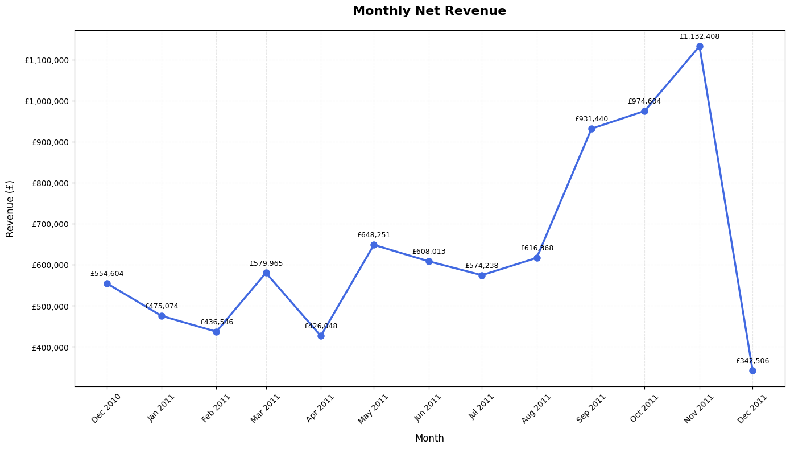
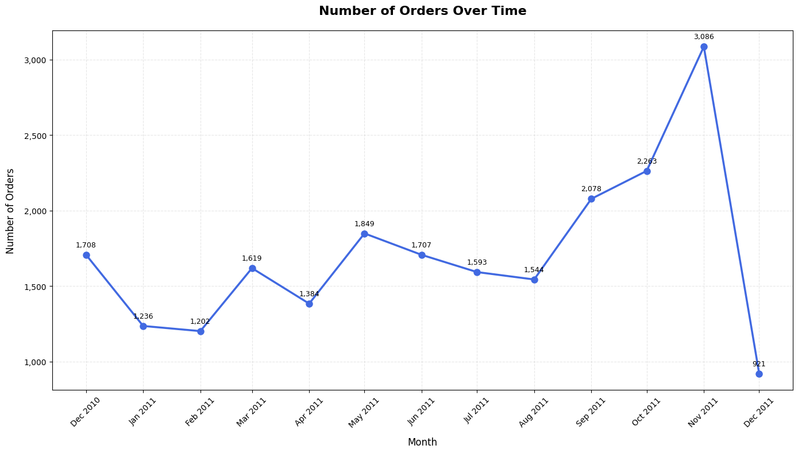
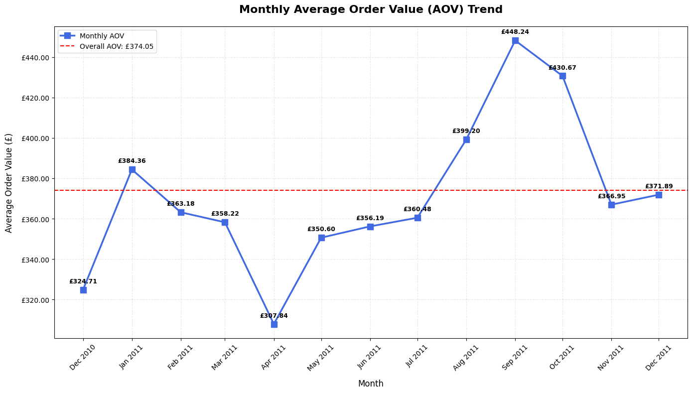
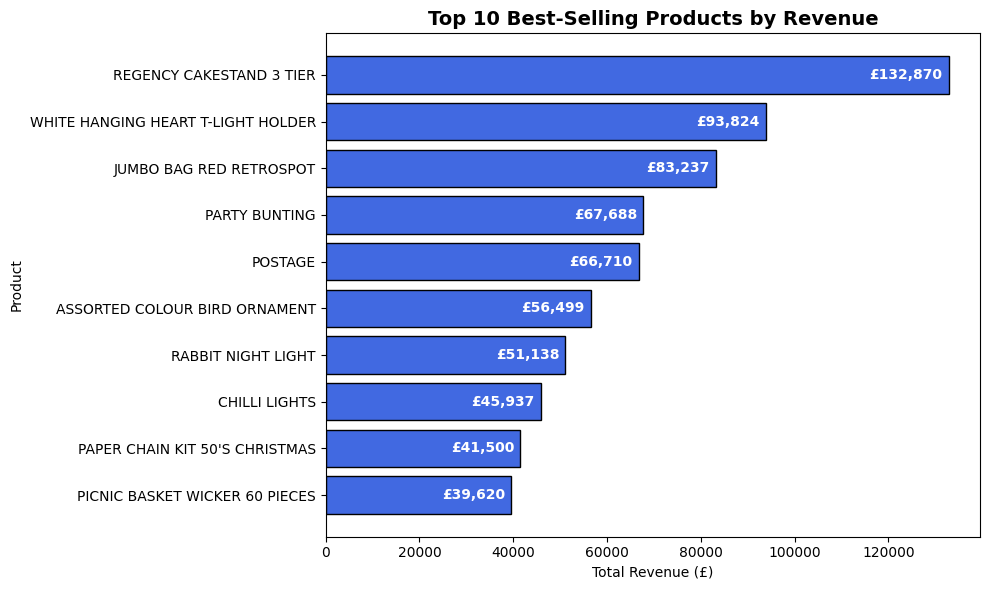
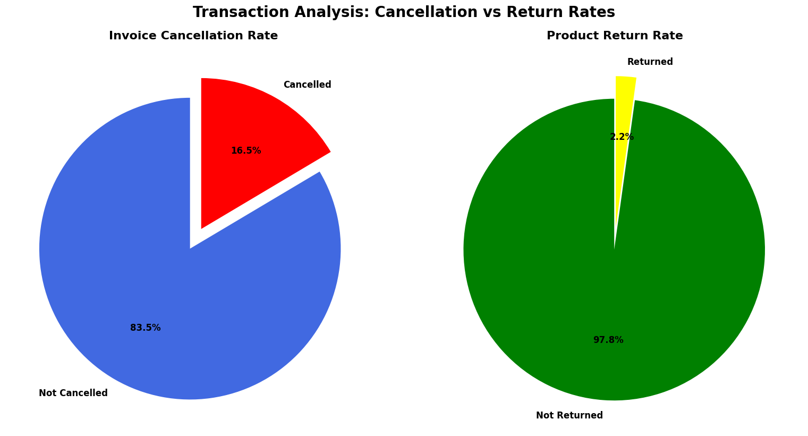
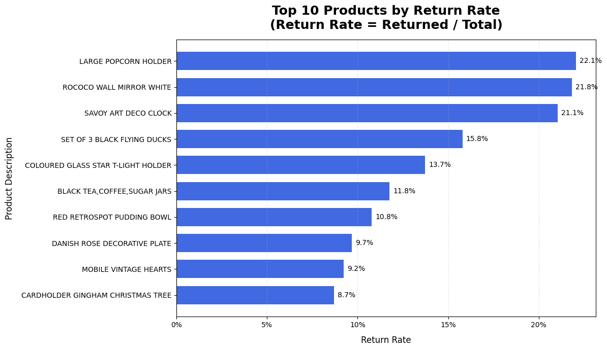
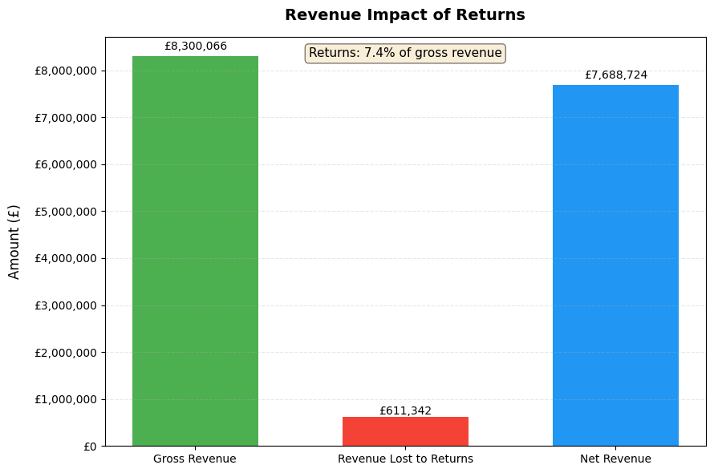
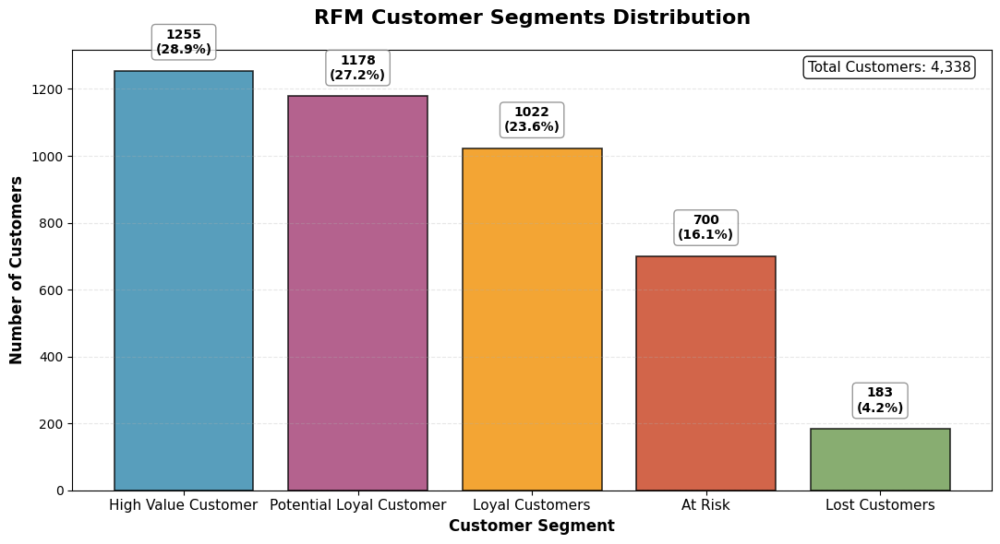
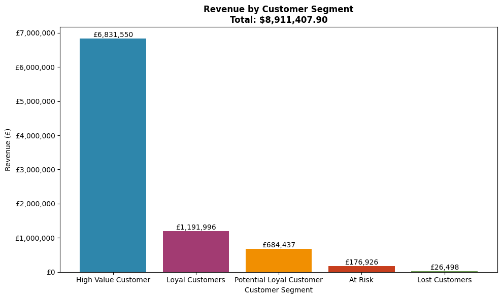
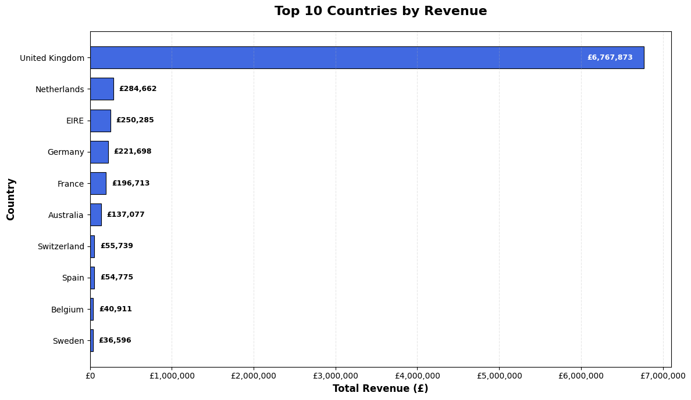

# Online Retail Analysis: Key Findings Report

**Analysis Date:** December 2025  
**Dataset:** 406,829 transactions (Dec 2010 - Dec 2011)  
**Author:** Christian Takahipe

---

## Executive Summary

### **Top Business Insights:**
- Revenue growth is strong but highly concentrated, with 28.9% of customers generating 76.7% of total revenue, indicating a clear Pareto effect.
- Sales show a consistent upward trend throughout 2011, peaking in November, suggesting strong seasonality and successful demand momentum.
- Returns remain relatively low (2.2% overall), but a small set of products disproportionately drives return-related revenue loss.
- The United Kingdom dominates revenue generation, while several European markets present clear expansion opportunities.

### **Actionable Recommendation:**
Prioritize retention and value maximization of high-value and loyal customers while deploying targeted win-back and nurturing campaigns for lower-value segments. At the same time, optimize the product portfolio by addressing high-return items and leverage geographic insights to guide international growth.

---

## Detailed Analysis

### 1. **Sales Performance**

#### **Monthly Trends**

**Key Findings:**
- Peak sales in **November 2011** (£1.1M revenue and 3,086 orders)
- Peak average order value in **September 2011** (£448.24 AOV)
- Lowest sales in **December 2011** (£342K revenue)
- Strong upward trend throughout 2011
- Average monthly net revenue growth: **2.82%**
- Average monthly order value: **£374.05**

**Insight:** The business demonstrates healthy and sustained growth, driven by increasing order volumes rather than price inflation alone. Seasonal peaks suggest that promotional and inventory planning ahead of Q4 is critical to fully capitalize on demand.

### 2. **Product Analysis**

#### **Top Performing Products**

**Top 5 Products by Revenue:**
1. **REGENCY CAKESTAND 3 TIER** - £132,870
2. **WHITE HANGING HEART T-LIGHT HOLDER** - £93,824
3. **JUMBO BAG RED RETROSPOT** - £83,237
4. **PARTY BUNTING** - £67,688
5. **POSTAGE** - £66,710

#### **Return Analysis:**

- Overall return rate: **2.2%**
- Overall revenue lost from return: £611,342
- Highest return product: **LARGE POPCORN HOLDER** (22.1% return rate)

### 3. **Customer Behavior**

**Identified Segments:**
| RFM Segment | Customers | % of Customers | Avg Revenue (£) | Revenue Contribution | % of Total Revenue | Recommended Action |
|------------|-----------|----------------|------------------|----------------------|--------------------|--------------------|
| High Value Customers | 1,255 | 28.9% | 5,443.47 | £6,831,550.48 | 76.7% | Retention programs, VIP rewards, personalized offers |
| Loyal Customers | 1,022 | 23.6% | 1,166.34 | £1,191,996.20 | 13.4% | Upselling, cross-selling, loyalty incentives |
| Potential Loyal Customers | 1,178 | 27.2% | 581.02 | £684,436.72 | 7.7% | Nurturing campaigns, targeted promotions |
| At Risk Customers | 700 | 16.1% | 252.75 | £176,926.04 | 2.0% | Win-back campaigns, discounts, reminders |
| Lost Customers | 183 | 4.2% | 144.80 | £26,498.46 | 0.3% | Limited reactivation efforts or exclusion |

### 4. **Geographic Analysis**

**Top 5 Countries by Revenue:**
1. **United Kingdom** - £6.8M
2. **Netherlands** - £284K
3. **Ireland** - £250K
4. **Germany** - £221K
5. **France** - £196K

**Insight:** Revenue is heavily concentrated in the UK, indicating market maturity. However, strong performance in nearby European countries highlights scalable international growth potential through localized marketing and logistics optimization.

---

## Business Recommendations

### **Immediate Actions (1-3 months)**
1. Launch targeted retention campaigns for high-value and loyal customers (VIP perks, early access, personalized offers).
2. Address high-return products by reviewing product descriptions, quality issues, and supplier performance.
3. Optimize Q4 promotional planning using historical seasonal demand patterns.

### **Medium-Term Strategy (3-6 months)**
1. Develop structured loyalty programs to convert potential loyal customers into repeat high-value buyers.
2. Implement predictive models to identify at-risk customers earlier and trigger proactive win-back actions.
3. Expand marketing efforts in high-performing European markets (Netherlands, Ireland, Germany).

### **Long-Term Vision (6-12 months)**
1. Build a customer lifetime value (CLV)-driven strategy to guide marketing spend and personalization at scale.
2. Diversify revenue streams by expanding product bundles around top-performing items.
3. Invest in advanced analytics and automation to support data-driven decision-making across sales, marketing, and operations.

---